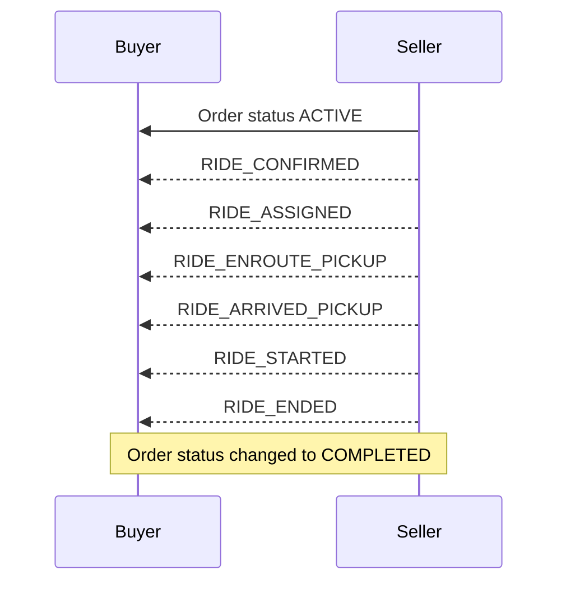
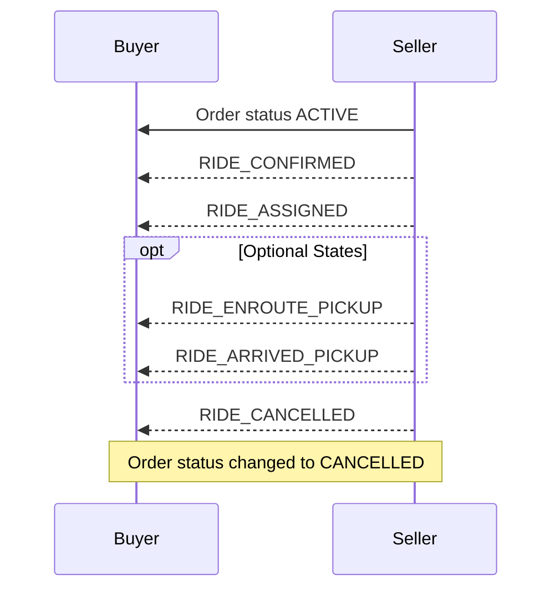
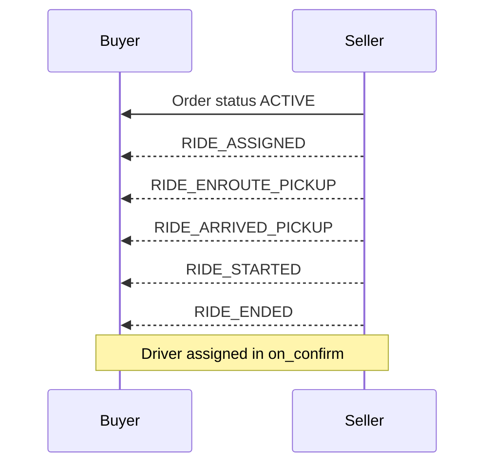
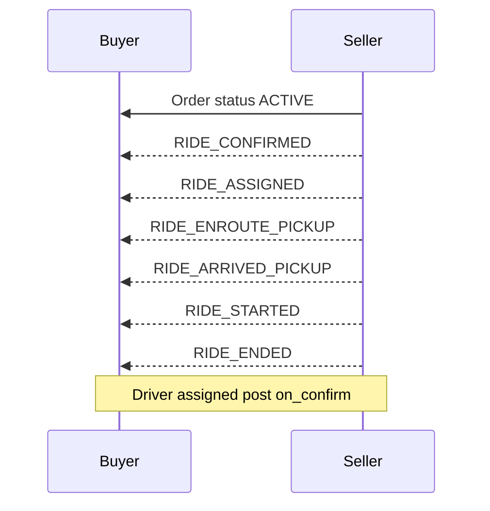

# Order Fulfillment States Documentation

## Overview
This document describes the fulfillment states based on various order statuses and scenarios. The fulfillment states define the stages of the order journey and vary depending on the order status and the specific scenario.

## Fulfillment States Based on Order Status

### 1. Order Status: ACTIVE to COMPLETED
If the order status changes from `ACTIVE` to `COMPLETED`, the fulfillment state can be one of the following:
- RIDE_CONFIRMED
- RIDE_ASSIGNED
- RIDE_ENROUTE_PICKUP
- RIDE_ARRIVED_PICKUP
- RIDE_STARTED
- RIDE_ENDED



### 2. Order Status: ACTIVE to CANCELLED  
If the order status changes from ACTIVE to CANCELLED, the fulfillment state can be one of the following
- RIDE_CONFIRMED
- RIDE_ASSIGNED
- RIDE_ENROUTE_PICKUP (Optional)
- RIDE_ARRIVED_PICKUP (Optional)
- RIDE_CANCELLED 


## Scenarios Based use cases
### Scenario 1: Assign Driver in on_confirm
When the driver is assigned in the on_confirm stage and the order status is ACTIVE, the fulfillment states can be:
  - RIDE_ASSIGNED
  - RIDE_ENROUTE_PICKUP
  - RIDE_ARRIVED_PICKUP
  - RIDE_STARTED
  - RIDE_ENDED

### Scenario 2: Assign Driver Post on_confirm
  When the driver is assigned after the on_confirm stage and the order status is ACTIVE, the fulfillment states can be:
  - RIDE_CONFIRMED
  - RIDE_ASSIGNED
  - RIDE_ENROUTE_PICKUP
  - RIDE_ARRIVED_PICKUP
  - RIDE_STARTED
  - RIDE_ENDED

### Scenario 3: For Fulfilment type SELF_PICKUP
  For orders with a fulfillment type of SELF_PICKUP and the order status is ACTIVE, the fulfillment states can be
  - RIDE_CONFIRMED
  - RIDE_ASSIGNED
  - RIDE_STARTED
  - RIDE_ENDED
   ```mermaid
    sequenceDiagram
    participant Buyer
    participant Seller

    Seller->>Buyer: Order status ACTIVE
    Seller-->>Buyer: RIDE_CONFIRMED
    Seller-->>Buyer: RIDE_ASSIGNED
    Seller-->>Buyer: RIDE_STARTED
    Seller-->>Buyer: RIDE_ENDED
    Note over Buyer, Seller: Fulfillment type SELF_PICKUP
```    

### If the order status changes to COMPLETED, the fulfillment state can be:
  - RIDE_ENDED
 
